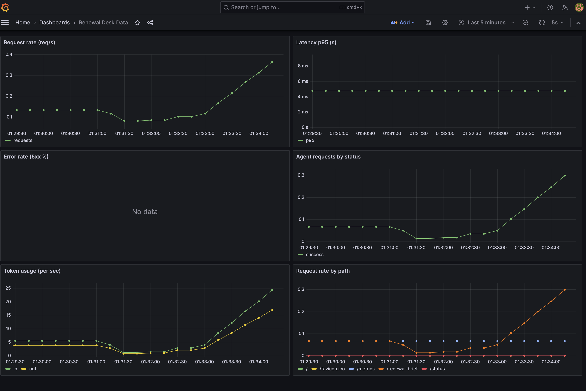
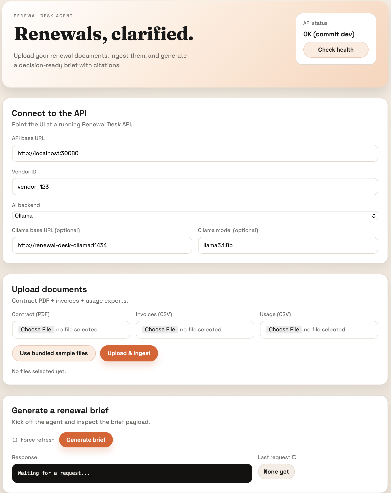

# Renewal Desk Agent

[](https://github.com/ahmedbadawy4/llm-renewal-desk-agent/actions/workflows/ci.yml)

Production-grade LLM decision-support agent for SaaS vendor renewals. It ingests contracts, invoices, and usage exports, runs retrieval + tool-gated reasoning, and returns a renewal brief with citations, risk flags, negotiation plan, and draft outreach.

## 90-second demo
Option A: **Docker Compose (fastest)**
1. **Boot the stack**
   ```bash
   make docker-up
   ```
   Ensure Ollama is running locally and the model is pulled:
   ```bash
   ollama serve
   ollama pull llama3.1:8b
   ```
2. **Ingest the sample data**
   ```bash
   make ingest-sample
   ```
3. **Generate a renewal brief**
   ```bash
   curl -sS -X POST "http://localhost:8000/renewal-brief?vendor_id=vendor_123" \
     -H "Content-Type: application/json" \
     -d '{"refresh": false}' | python -m json.tool
   ```
4. **Open Grafana** at http://localhost:3000 to see latency/token/tool metrics.

Option B: **Helm (full stack)**
Requires a local Kubernetes cluster (Docker Desktop, minikube, or kind) and Helm.
1. **Boot the stack**
   ```bash
   make helm-install
   ```
2. **Ingest the sample data**
   ```bash
   make helm-ingest-sample
   ```
3. **Generate a renewal brief**
   ```bash
   make helm-renewal-brief
   ```
4. **Open Grafana** at http://localhost:30030 to see latency/token/tool metrics.

If your cluster does not expose NodePorts on localhost, use port-forward:
```bash
make helm-port-forward
```
Generate traffic to populate dashboards:
```bash
make helm-traffic REQUESTS=10 SLEEP=1
```



## What you get
- **Agent design**: LLM-style loop with retrieval + tool orchestration for real workflows.
- **Integration**: Clear API surface (`/ingest`, `/renewal-brief`) built for embedding into products and internal systems.
- **Guardrails**: Prompt injection detection, schema validation, and RBAC-style tool gating.
- **Reliability**: Budgets, validation outcomes, and error-rate monitoring as production signals.
- **Observability**: OTel traces + Prometheus metrics + Grafana dashboards + live debug traces.
- **Eval-ready**: Golden cases, injection suite, CI smoke evals.

## Case Study (1 page)
- **Problem**: Renewal ops teams need a fast, defensible brief that ties contract terms, spend, and usage into a negotiation plan with auditable evidence.
- **Constraints**: Stable API (`/ingest`, `/renewal-brief`), strict schema outputs, citation coverage, low operational overhead, and clear demo path on a laptop.
- **Architecture**: FastAPI service with retrieval → extraction → LLM synthesis (Ollama) → schema validation → response build, plus a local object store and sample data fallback.
- **Guardrails**: Prompt injection scan, strict Pydantic validation, citation enforcement with post-repair, fail-closed unknowns when evidence is missing.
- **Observability**: OTel spans for retrieval/LLM/validation/response build, Prometheus metrics for latency, tokens, LLM errors, validation failures, and citation coverage; Grafana dashboards included.
- **Cost controls**: Daily budget gate (USD, approximate), request timeout, and output token caps with graceful degradation to heuristic synthesis if limits are hit.
- **Demo steps**: Run Ollama → start stack → ingest sample files → call `/renewal-brief` → inspect Grafana + `/debug/trace/{request_id}`.
- **Roadmap**: Real PDF parsing + hybrid retrieval, model routing (local vs hosted), and richer eval harness with regression thresholds.

## Current implementation status
- Implemented: API endpoints, Ollama-backed synthesis with strict schema+citation validation, metrics/traces, debug trace endpoint, eval harness skeleton
- Simplified: PDF parsing, hybrid retrieval, and extraction heuristics
- Not yet: multi-model routing, AWS Terraform

## Portfolio note (AI Systems Engineer)
This repo is built as a production-style AI systems portfolio piece. It emphasizes dependable ingest flows, retrieval/tool orchestration, strict schema validation, and observable deployments. The goal is to demonstrate end-to-end system engineering: infrastructure-as-code, runtime guardrails, cost/latency controls, and metrics-driven operations.

## Debuggability proof
Minimal trace endpoint is live at `/debug/trace/{request_id}` (in-memory, last 200) and returns:
- retrieved doc IDs
- tool calls invoked
- token counters (in/out/total)
- validation outcomes

Example (Docker Compose):
```bash
curl -sS "http://localhost:8000/debug/trace/<request_id>" | python -m json.tool
```

## API extras
- **Demo brief**: `/demo/renewal-brief` generates a brief from bundled sample files (no ingest needed).
  ```bash
  curl -sS "http://localhost:8000/demo/renewal-brief?vendor_id=vendor_123" | python -m json.tool
  ```
- **LLM health**: `/llm/health` checks Ollama connectivity and model availability (when enabled).
  ```bash
  curl -sS "http://localhost:8000/llm/health" | python -m json.tool
  ```

## Sample output (redacted)
Example `POST /renewal-brief` response (truncated, citations included):
```json
{
  "status": "ok",
  "request_id": "0b4f0c0b-acde-4c11-9bdb-2f0f4e9497db",
  "brief": {
    "vendor_id": "vendor_123",
    "request_id": "0b4f0c0b-acde-4c11-9bdb-2f0f4e9497db",
    "renewal_terms": {
      "term_start": "2024-02-01",
      "term_end": "2025-02-01",
      "notice_window_days": 60,
      "auto_renew": true,
      "citations": [{"doc_id": "contract.pdf", "page": 2, "span": "TERM"}]
    },
    "pricing": {
      "annual_spend_usd": 120000,
      "uplift_clause_pct": 5,
      "citations": [{"doc_id": "invoices.csv", "page": 1, "span": "PRICING"}]
    },
    "usage": {
      "allocated_seats": 500,
      "active_seats": 420,
      "delta_percent": -16,
      "citations": [{"doc_id": "usage.csv", "page": 1, "span": "USAGE"}]
    },
    "risk_flags": {
      "auto_renew_soon": true,
      "liability_cap_multiple": 2,
      "dpa_status": "present",
      "pii_risk": "low",
      "citations": [{"doc_id": "contract.pdf", "page": 2, "span": "RISK"}]
    },
    "negotiation_plan": {
      "target_discount_pct": 10,
      "walkaway_delta_pct": 15,
      "levers": ["Usage below contracted seats"],
      "citations": [{"doc_id": "contract.pdf", "page": 2, "span": "NEGOTIATION"}]
    },
    "draft_email": {
      "subject": "Vendor_123 renewal discussion",
      "body": "Hi Vendor_123 team, ..."
    }
  }
}
```

## Supported LLM providers
- Default: Ollama via `LLM_PROVIDER=ollama`, `LLM_BASE_URL`, and `LLM_MODEL` (local-first).
- Mock mode for tests or offline runs with `LLM_PROVIDER=mock`.
- Intended: OpenAI-compatible API endpoints once wiring is enabled.

## Demo mode configuration
Set these environment variables for the local demo path (Compose/Helm already wires defaults):
- `LLM_PROVIDER=ollama`
- `LLM_BASE_URL=http://host.docker.internal:11434`
- `LLM_MODEL=llama3.1:8b`
- `MAX_OUTPUT_TOKENS=800`
- `REQUEST_TIMEOUT_S=30`
- `DAILY_BUDGET_USD=1.0` (approximate budget gate)

## How this maps to the role
- **End-to-end ownership**: Ingestion, retrieval, agent loop, and infra paths in one repo.
- **Guardrails**: Schema validation, prompt-injection checks, tool gating, and traceability.
- **Observability**: OTel traces, Prometheus metrics, Grafana dashboards, and debug traces.
- **Cost control**: Token counters, budgets, and eval harness for regression checks.
- **Deployment readiness**: Docker Compose and Helm paths with repeatable scripts.
- **Evaluation rigor**: Golden cases and smoke evals to keep outputs bounded.

## How it works (high level)
- Ingests vendor contract/invoice/usage files into a local object store and updates a per-vendor manifest.
- Serves a FastAPI endpoint (`/renewal-brief`) that runs retrieval + tool-gated reasoning to generate a structured renewal brief.
- Exposes Prometheus metrics on `/metrics` for request rate, latency, agent status, and token usage.

## What happens on traffic
- Each POST increments request counters and adds latency samples.
- Agent counters (status) and token counters increase per run.
- Prometheus scrapes metrics every 15s; Grafana charts update shortly after.

## Grafana dashboard (panels)
- **Request rate (req/s)**: total API call volume over time.
- **Latency p95 (s)**: tail latency for API responses.
- **Error rate (5xx %)**: server error percentage.
- **Agent requests by status**: success vs failure count rate.
- **Token usage (per sec)**: in/out token counters.
- **Request rate by path**: which endpoints are being hit.
- **LLM errors**: LLM call failures, schema issues, or budget overruns.
- **Validation failures**: schema or citation validation drops.
- **Citation coverage ratio**: percent of sections with citations.

## Quickstart (local dev)
1. **Install dependencies**
   ```bash
   pipx install poetry  # optional
   make install
   ```
2. **Run API locally**
   ```bash
   make run-api  # or uvicorn src.app.main:app
   ```
3. **Run evals**
   ```bash
   make eval
   ```
4. **Shut everything down**
   ```bash
   make docker-down
   ```

## Simple UI (separate, static)
A lightweight UI lives in `ui/` and runs as a separate static server.
1. **Run the API**
   ```bash
   make run-api
   ```
2. **Serve the UI**
   ```bash
   python -m http.server 5173 -d ui
   ```
3. **Open the UI** at http://localhost:5173 and use the bundled sample files.
The UI includes an AI backend selector (mock or Ollama) per request and a debug trace viewer.



## Helm (Kubernetes)
```bash
make helm-install  # builds a local image, installs the chart, and deploys Ollama
```
For kind, pass `KIND_CLUSTER=your-cluster` so the image is loaded into the node.
Access URLs:
```bash
make helm-urls
```
UI runs as a separate NodePort service (default http://localhost:30081). It ships with bundled sample files.
Ollama (included by default in Helm):
- `helm-install` deploys an in-cluster Ollama and pre-pulls models.
- To point at an existing Ollama service instead:
```bash
make helm-install-ollama-external OLLAMA_BASE_URL=http://<ollama-host>:11434
```
Ingress (optional, API + UI on separate hostnames):
```bash
helm upgrade --install renewal-desk charts/renewal-desk \
  --set ingress.enabled=true \
  --set ingress.className=nginx \
  --set ingress.hosts[0].host=renewal-desk.local \
  --set ingress.hosts[1].host=renewal-desk-api.local
```
Debug trace (Helm/NodePort):
```bash
curl -sS "http://localhost:30080/debug/trace/<request_id>" | python -m json.tool
```
If the dashboard does not auto-provision, restart Grafana:
```bash
make helm-restart-grafana
```

## Troubleshooting
- Grafana empty: generate traffic with `make helm-traffic REQUESTS=10 SLEEP=1`.
- Cannot access NodePorts: use port-forward (API: `make helm-port-forward`, Grafana: `kubectl -n renewal-desk port-forward svc/renewal-desk-grafana 3000:3000`).
- Reset state: `docker compose -f infra/docker-compose.yml down -v` and remove `.data`.

## Cleanup
```bash
make helm-uninstall
docker compose -f infra/docker-compose.yml down -v
rm -rf .data
```

## Architecture (short)
- `src/app` holds the FastAPI service, agent runner, tool gateway, RAG components, and storage adapters.
- `docs/architecture.md` and `docs/data-flow.md` explain ingestion, retrieval routing, validation, and observability.
- `infra/` contains docker-compose, Grafana provisioning, Prometheus, and OTel collector config.

## Docs
- `docs/local-development.md`: Docker + Minikube notes
- `docs/runbook.md`: Demo + incident procedures
- `docs/threat-model.md`: Security posture and risks
- `docs/architecture.md`: C4-ish view
- `docs/data-flow.md`: End-to-end flow

## Roadmap
- [ ] Implement document parsing (pdfminer/pymupdf) + table extraction
- [ ] Build pgvector migrations + hybrid retrieval queries
- [ ] Finish agent loop with multi-model routing
- [ ] Expand evaluator with cost/latency budgets + tolerance bands
- [ ] Add Terraform modules for AWS ECS + RDS + OpenSearch
- [ ] Ship a thin React/Next.js UI + Slack slash command
