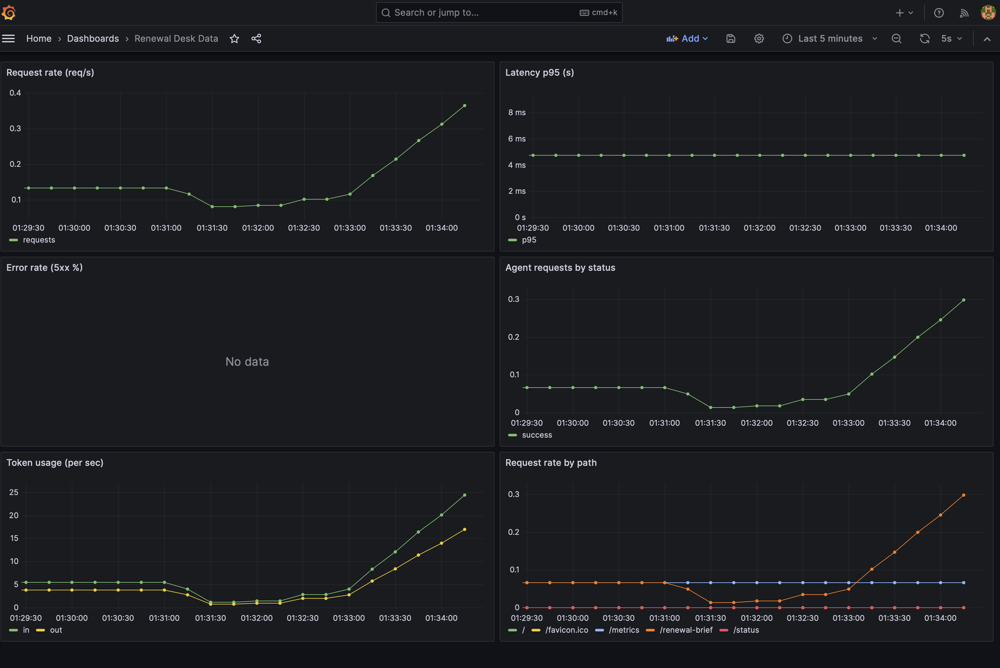
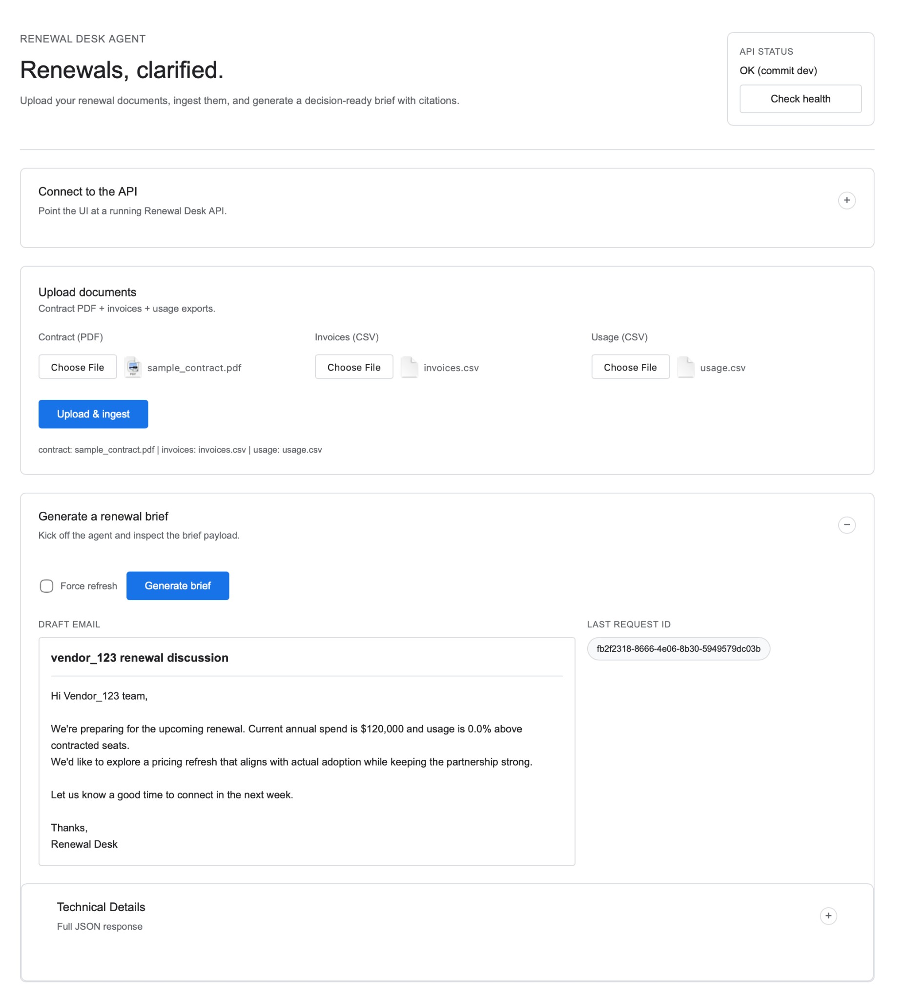

# Renewal Desk Agent

[](https://github.com/ahmedbadawy4/llm-renewal-desk-agent/actions/workflows/ci.yml)

Production-grade LLM decision-support agent for SaaS vendor renewals. Automates the analysis of contracts, invoices, and usage data to generate structured renewal briefs with citations, risk assessments, and negotiation strategies.

## Overview

The Renewal Desk Agent is an AI-powered system that helps renewal operations teams quickly analyze vendor contracts and generate actionable renewal briefs. It combines:

- **Document Processing**: Ingests PDF contracts, CSV invoices, and usage exports
- **Intelligent Retrieval**: Extracts key terms, pricing, and usage patterns
- **LLM-Powered Analysis**: Synthesizes findings into structured renewal briefs
- **Production Guardrails**: Prompt injection detection, schema validation, citation enforcement
- **Full Observability**: Prometheus metrics, OpenTelemetry traces, Grafana dashboards

### What It Does

The system processes vendor renewal data through a multi-stage pipeline:

1. **Ingestion**: Uploads contract PDFs, invoice CSVs, and usage data via `/ingest` endpoint
2. **Document Processing**: Parses PDFs to extract text and tables, processes CSVs for financial data
3. **Field Extraction**: Uses regex patterns and deterministic parsing to extract structured facts (term dates, pricing, seat counts)
4. **LLM Synthesis**: Sends pre-extracted facts and raw evidence to an LLM (Ollama or OpenAI) to generate insights
5. **Validation**: Enforces strict schema compliance and requires citations for all claims
6. **Response Assembly**: Returns a structured `RenewalBrief` with renewal terms, pricing analysis, usage insights, risk flags, negotiation plan, and draft email

### Key Features

- **Structured Output**: Pydantic-validated JSON responses with strict schema enforcement
- **Citation Enforcement**: Every claim must have source citations; missing citations trigger repair or fail-closed behavior
- **AI Safety**: Multi-layer guardrails including prompt injection detection, budget controls, and token limits
- **Reliability**: Fallback heuristics ensure the system works even when LLM calls fail
- **Observability**: Comprehensive metrics, traces, and debug endpoints for production monitoring
- **Flexible Deployment**: Docker Compose for local development, Helm charts for Kubernetes

## Quick Start

### Option A: Docker Compose (Fastest)

1. **Start the stack**
   ```bash
   make docker-up
   ```

2. **Ensure Ollama is running locally**
   ```bash
   ollama serve
   ollama pull llama3.1:8b
   ```

3. **Ingest sample data**
   ```bash
   make ingest-sample
   ```

4. **Generate a renewal brief**
   ```bash
   curl -sS -X POST "http://localhost:8000/renewal-brief?vendor_id=vendor_123" \
     -H "Content-Type: application/json" \
     -d '{"refresh": false}' | python -m json.tool
   ```

5. **View metrics in Grafana** at http://localhost:3000

### Option B: Helm (Kubernetes)

Requires a local Kubernetes cluster (Docker Desktop, minikube, or kind).

1. **Install the stack**
   ```bash
   make helm-install
   ```

2. **Ingest sample data**
   ```bash
   make helm-ingest-sample
   ```

3. **Generate a renewal brief**
   ```bash
   make helm-renewal-brief
   ```

4. **View metrics in Grafana** at http://localhost:30030

If your cluster doesn't expose NodePorts, use port-forward:
```bash
make helm-port-forward
```

## Architecture

### System Components

- **FastAPI Application** (`src/app/main.py`): REST API with endpoints for ingestion and brief generation
- **Agent Runner** (`src/app/agent/runner.py`): Orchestrates document retrieval, extraction, LLM synthesis, and validation
- **Document Processing** (`src/app/storage/pdf_parser.py`): PDF parsing with pymupdf for text and table extraction
- **Storage Layer** (`src/app/storage/object_store.py`): Local filesystem storage with manifest tracking
- **LLM Integration** (`src/app/llm/ollama.py`, `src/app/llm/router.py`): Multi-provider LLM routing with retry and circuit breaker logic
- **Observability** (`src/app/core/metrics.py`, `src/app/core/tracing.py`): Prometheus metrics and OpenTelemetry distributed tracing

### Request Flow

1. **API Request** → FastAPI receives POST to `/renewal-brief` with `vendor_id`
2. **Document Retrieval** → Loads contract, invoices, and usage files from object store
3. **Input Sanitization** → Scans for prompt injection patterns before LLM interaction
4. **Field Extraction** → Regex-based extraction of contract terms, invoice aggregation, usage calculations
5. **Budget Check** → Validates daily budget before LLM call
6. **Prompt Construction** → Builds constrained prompt with system instructions, schema examples, and evidence
7. **LLM Call** → Sends to Ollama/OpenAI with timeout and token limits
8. **JSON Extraction** → Parses LLM response, handles markdown-wrapped JSON
9. **Schema Validation** → Pydantic validation enforces types and structure
10. **Citation Validation** → Ensures all populated fields have citations; repairs if missing
11. **Response Assembly** → Builds final `RenewalBrief` with all sections
12. **Metrics & Tracing** → Records Prometheus metrics and debug traces

### AI Control Mechanisms

The system implements multiple layers to ensure reliable, auditable outputs:

1. **Input Sanitization**: Prompt injection detection blocks malicious input before LLM interaction
2. **Constrained Prompting**: System prompts define strict role and output format requirements
3. **Output Validation**: Pydantic schemas enforce structure; `extra="forbid"` prevents unexpected fields
4. **Citation Enforcement**: Every claim must have source citations; missing citations trigger repair or fail-closed behavior
5. **Budget & Token Limits**: Daily budget tracking, output token caps, and request timeouts prevent runaway costs
6. **Fallback Heuristics**: Deterministic extraction and template-based generation when LLM fails

See `TECHNICAL_README.md` for detailed code-level documentation.

## API Reference

### POST `/ingest`

Uploads contract, invoice, and usage files for a vendor.

**Parameters:**
- `vendor_id` (query): Vendor identifier
- `contract` (form-data): PDF contract file
- `invoices` (form-data): CSV invoice file
- `usage` (form-data): CSV usage file

**Response:**
```json
{
  "status": "accepted",
  "vendor_id": "vendor_123",
  "message": "Ingestion scheduled",
  "job_ids": ["uuid-1", "uuid-2", "uuid-3"],
  "files": {
    "contract": "/data/vendor_123/contract_sample_contract.pdf",
    "invoices": "/data/vendor_123/invoices_invoices.csv",
    "usage": "/data/vendor_123/usage_usage.csv"
  }
}
```

### POST `/renewal-brief`

Generates a renewal brief for a vendor.

**Parameters:**
- `vendor_id` (query): Vendor identifier
- `refresh` (body, optional): Force refresh (ignore cache)

**Response:**
```json
{
  "status": "ok",
  "request_id": "0b4f0c0b-acde-4c11-9bdb-2f0f4e9497db",
  "brief": {
    "vendor_id": "vendor_123",
    "renewal_terms": {
      "term_start": "2024-01-01",
      "term_end": "2024-12-31",
      "notice_window_days": 90,
      "auto_renew": true,
      "citations": [{"doc_id": "contract.pdf", "page": 2, "span": "TERM"}]
    },
    "pricing": {
      "annual_spend_usd": 120000,
      "uplift_clause_pct": 5,
      "citations": [{"doc_id": "invoices.csv", "span": "PRICING"}]
    },
    "usage": {
      "allocated_seats": 500,
      "active_seats": 475,
      "delta_percent": -5.0,
      "citations": [{"doc_id": "usage.csv", "span": "USAGE"}]
    },
    "risk_flags": {
      "auto_renew_soon": true,
      "liability_cap_multiple": 2,
      "dpa_status": "present",
      "pii_risk": "low",
      "citations": [{"doc_id": "contract.pdf", "span": "RISK"}]
    },
    "negotiation_plan": {
      "target_discount_pct": 10,
      "walkaway_delta_pct": 15,
      "levers": ["Usage below contracted seats"],
      "citations": [{"doc_id": "contract.pdf", "span": "NEGOTIATION"}]
    },
    "draft_email": {
      "subject": "vendor_123 renewal discussion",
      "body": "Hi vendor_123 team,\n\nWe're preparing for the upcoming renewal..."
    }
  }
}
```

### GET `/jobs`

Lists async processing jobs for a vendor.

**Parameters:**
- `vendor_id` (query, optional): Filter by vendor

### GET `/jobs/{job_id}`

Gets status of a specific async job.

### GET `/debug/trace/{request_id}`

Retrieves debug trace for a renewal brief request.

### GET `/demo/renewal-brief`

Generates a brief using bundled sample files (no ingestion required).

## Observability

### Grafana Dashboard

The system includes pre-configured Grafana dashboards showing:

- **Request Rate**: API call volume over time
- **Latency (p95)**: Tail latency for API responses
- **Error Rate**: Server error percentage
- **Agent Status**: Success vs failure counts
- **Token Usage**: Input/output token counters
- **LLM Errors**: LLM call failures, schema issues, budget overruns
- **Validation Failures**: Schema or citation validation drops
- **Citation Coverage**: Percentage of sections with citations



### Prometheus Metrics

Metrics are exposed at `/metrics` endpoint:

- `api_requests_total`: HTTP request counter
- `api_request_latency_seconds`: Request latency histogram
- `agent_requests_total`: Renewal brief counter by status
- `agent_tokens_total`: Token usage counter
- `llm_errors_total`: LLM error counter
- `validation_failures_total`: Validation failure counter
- `citation_coverage_ratio`: Citation coverage gauge

### Debug Traces

Each request generates a debug trace accessible via `/debug/trace/{request_id}` containing:

- Retrieved document IDs
- Tool calls invoked
- Token counts (input/output/total)
- Validation outcomes
- Citation coverage

## UI

A lightweight web UI is included for testing and demos:

1. **Run the API**
   ```bash
   make run-api
   ```

2. **Serve the UI**
   ```bash
   python -m http.server 5173 -d ui
   ```

3. **Open** http://localhost:5173

The UI includes file upload, brief generation, and debug trace viewing.



## Development

### Local Setup

1. **Install dependencies**
   ```bash
   pipx install poetry  # optional
   make install
   ```

2. **Run API locally**
   ```bash
   make run-api
   ```

3. **Run tests**
   ```bash
   make test
   ```

4. **Run evaluations**
   ```bash
   make eval
   ```

### Project Structure

```
src/app/
  ├── main.py              # FastAPI application entry point
  ├── api/routes.py        # API endpoint definitions
  ├── agent/
  │   ├── runner.py        # Core agent orchestration
  │   ├── schemas.py       # Pydantic models
  │   ├── safety.py        # Prompt injection detection
  │   ├── validators.py    # Citation validation
  │   └── prompts/         # LLM prompt templates
  ├── llm/
  │   ├── ollama.py        # Ollama client
  │   ├── openai.py        # OpenAI client
  │   └── router.py        # Multi-provider routing
  ├── storage/
  │   ├── object_store.py  # File storage abstraction
  │   ├── pdf_parser.py    # PDF parsing
  │   ├── vector_store.py # pgvector integration
  │   └── postgres.py      # Database connection
  ├── rag/
  │   ├── retrieval.py     # Document retrieval
  │   ├── hybrid_search.py # Hybrid vector + BM25 search
  │   └── embeddings.py    # Sentence transformer embeddings
  ├── core/
  │   ├── config.py         # Application settings
  │   ├── metrics.py       # Prometheus metrics
  │   ├── tracing.py       # OpenTelemetry
  │   └── debug.py         # Debug trace store
  └── workers/
      ├── parser.py        # Async document processing
      └── job_queue.py     # Job queue management
```

### Configuration

Key environment variables:

- `LLM_PROVIDER`: `ollama` (default) or `openai`
- `LLM_BASE_URL`: Ollama API endpoint (default: `http://host.docker.internal:11434`)
- `LLM_MODEL`: Model name (default: `llama3.1:8b`)
- `MAX_OUTPUT_TOKENS`: Output token limit (default: `800`)
- `REQUEST_TIMEOUT_S`: LLM call timeout (default: `30`)
- `DAILY_BUDGET_USD`: Daily spending limit (default: `1.0`)
- `DATABASE_URL`: PostgreSQL connection string
- `DATA_DIR`: Storage directory (default: `.data`)

## Deployment

### Docker Compose

Full stack with PostgreSQL, Prometheus, Grafana, and OpenTelemetry collector:

```bash
make docker-up
```

### Helm (Kubernetes)

Deploy to Kubernetes with Helm:

```bash
make helm-install
```

The Helm chart includes:
- Application deployment with configurable replicas
- PostgreSQL with pgvector extension
- Prometheus for metrics collection
- Grafana with pre-configured dashboards
- OpenTelemetry collector
- Optional Ollama deployment
- UI service (NodePort)

For kind clusters:
```bash
make helm-install KIND_CLUSTER=your-cluster
```

### Ingress (Optional)

Enable ingress for API and UI:

```bash
helm upgrade --install renewal-desk charts/renewal-desk \
  --set ingress.enabled=true \
  --set ingress.className=nginx \
  --set ingress.hosts[0].host=renewal-desk.local \
  --set ingress.hosts[1].host=renewal-desk-api.local
```

## Troubleshooting

- **Grafana empty**: Generate traffic with `make helm-traffic REQUESTS=10 SLEEP=1`
- **Cannot access NodePorts**: Use port-forward (`make helm-port-forward`)
- **Reset state**: `docker compose -f infra/docker-compose.yml down -v` and remove `.data`
- **Migration pod failing**: Check PostgreSQL connectivity and ensure pgvector extension is enabled

## Cleanup

```bash
make helm-uninstall
docker compose -f infra/docker-compose.yml down -v
rm -rf .data
```

## Documentation

- `TECHNICAL_README.md`: Detailed code-level documentation and architecture
- `docs/architecture.md`: System architecture and component diagrams
- `docs/data-flow.md`: End-to-end request flow
- `docs/local-development.md`: Local development setup
- `docs/runbook.md`: Operations and incident procedures
- `docs/threat-model.md`: Security posture and threat analysis

## Roadmap

- [x] PDF parsing with pymupdf and table extraction
- [x] Hybrid retrieval with pgvector and BM25
- [x] Multi-model routing (Ollama, OpenAI)
- [x] Async document processing with job queue
- [x] Database migrations with Alembic
- [x] Enhanced evaluation harness with budgets and regression detection
- [ ] Terraform modules for AWS deployment (ECS, RDS, OpenSearch)
- [ ] React/Next.js UI with Slack integration
- [ ] Advanced PDF parsing with OCR support
- [ ] Multi-tenant RBAC and audit logging

## License

See [LICENSE](LICENSE) file for details.
